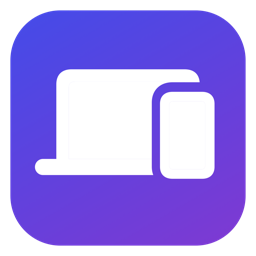
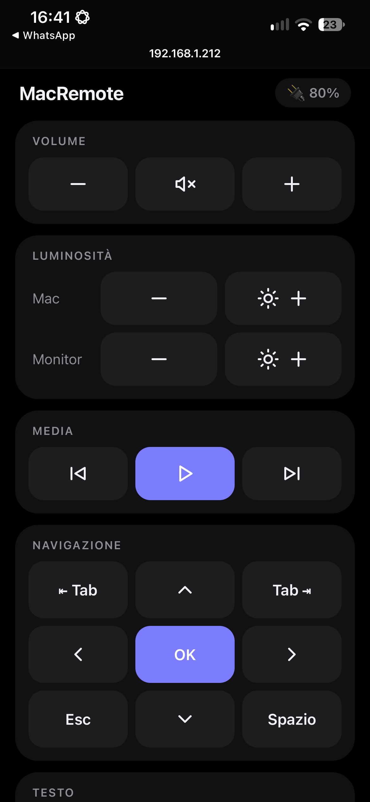
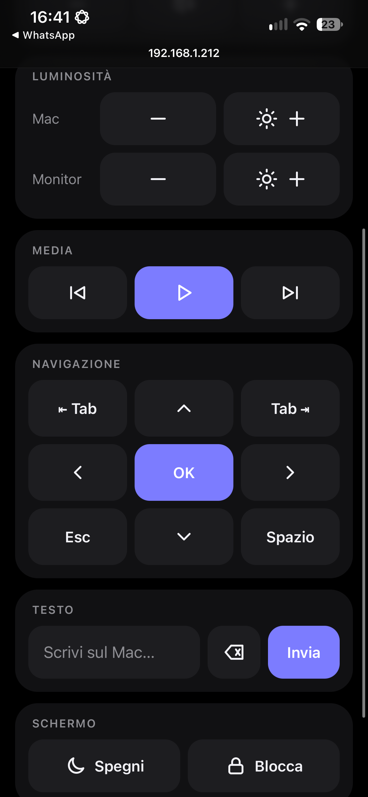
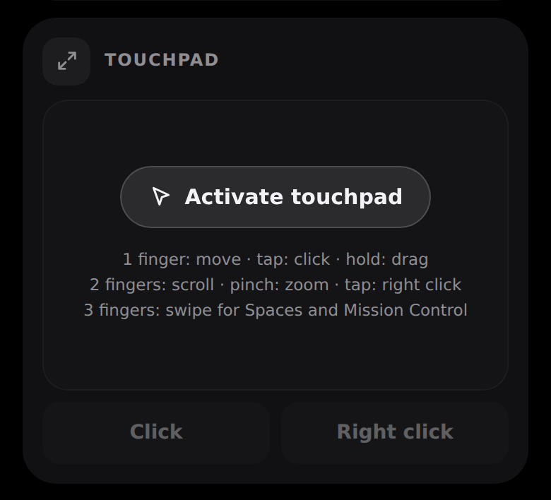
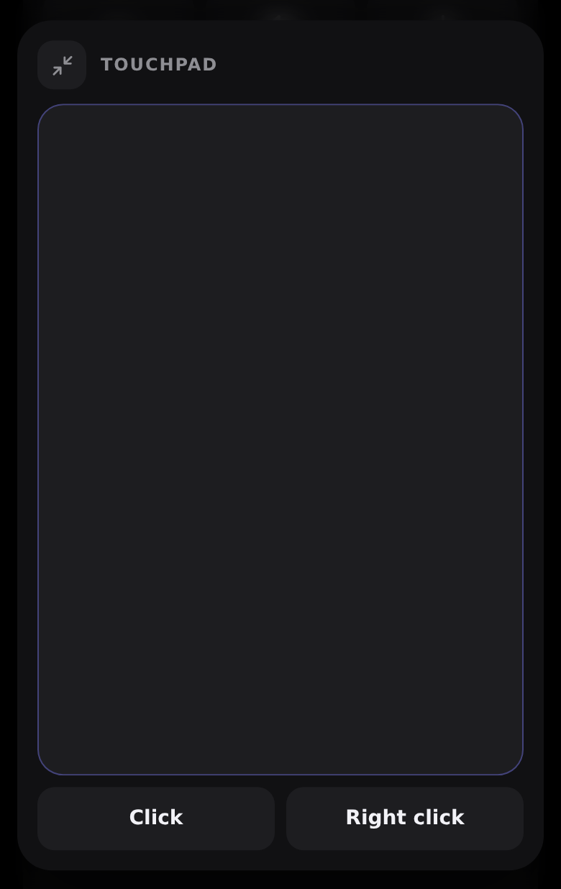
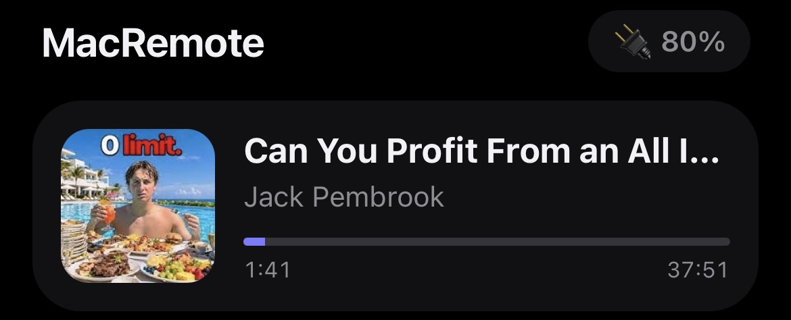
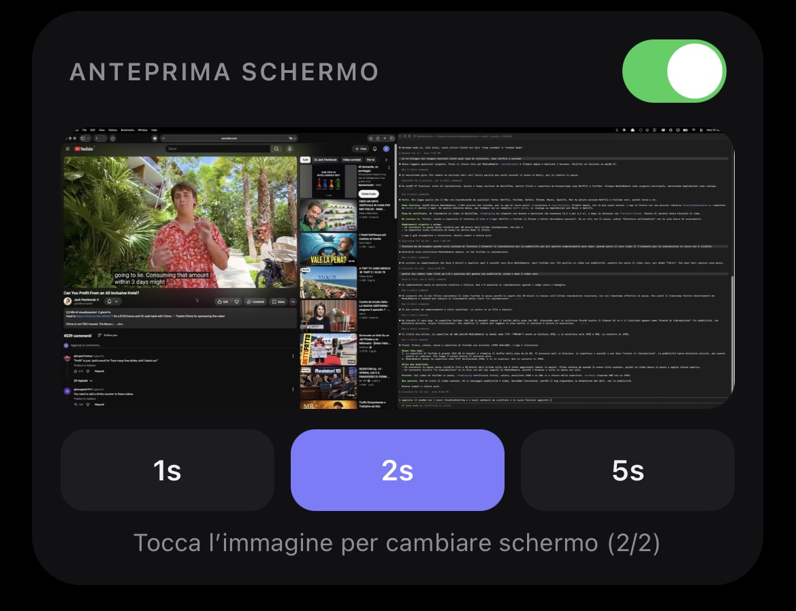
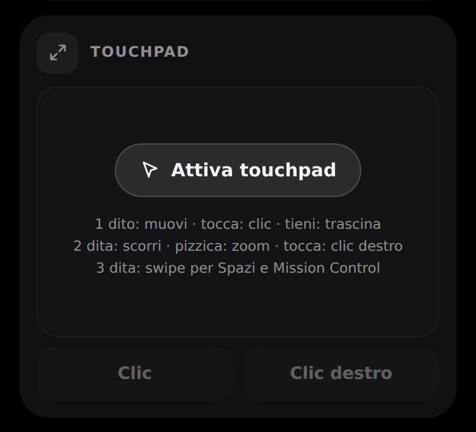
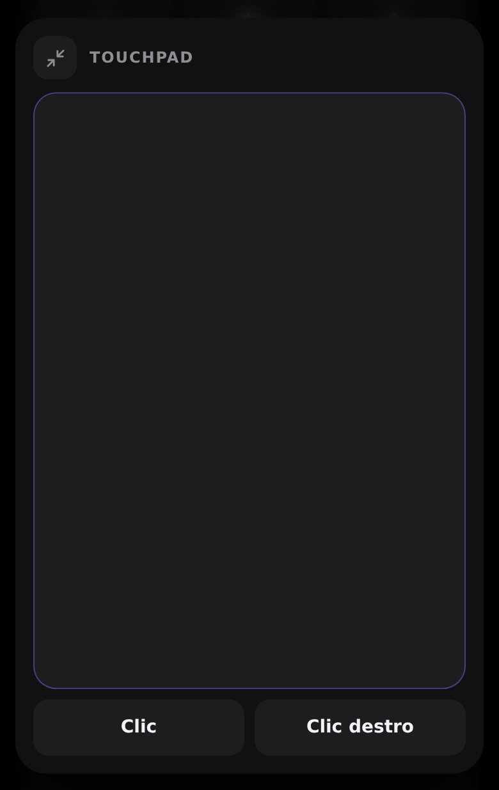

<div align="center">



# MacRemote

**Your Mac's basic controls on your iPhone. Local network only.**


[🇬🇧 English](#en) · [🇮🇹 Italiano](#it)

</div>

---

<a id="en"></a>

## 🇬🇧 English

[→ Passa all'italiano](#it)

### What it is

MacRemote is a remote control for your Mac, built for a typical situation: the Mac is connected to a monitor, you are in bed, and every time you need to change the volume or pause something you have to get up.

A small menu bar app runs on the Mac. Nothing to install on the iPhone: you open a web page in Safari (by scanning a QR code) and control the Mac from there.

### What it really does

- **Volume**: up, down, mute (system media keys).
- **Media**: play/pause, previous and next track.
- **Brightness**, with separate controls for the Mac's own display and the external monitor.
- **Navigation**: arrows, OK (Return), Esc, Tab, Shift+Tab, Space. Use them to move between clickable elements without a mouse.
- **Text**: type on the iPhone into the field that is focused on the Mac.
- **Touchpad**: a pad that works as the Mac's touchpad. 1 finger moves the pointer (with acceleration: slow is precise, fast crosses the screen), tap = click, double tap = double click, hold and move = drag. 2 fingers scroll (with momentum), moving them together or apart zooms, and a 2-finger tap is a right click. 3 fingers: swipe left/right to switch Space, up for Mission Control, down for the app's windows. Below it are **Click** (hold it and move on the pad to drag) and **Right click** buttons. The button at the top left of the section enlarges the touchpad (about 70% of the screen); the same button, or a touch outside the pad, shrinks it back. To avoid accidental touches the pad stays locked until you tap **Activate touchpad**, and locks again after 20 seconds without touches (**Resume** button).
- **Screen**: turn the display off (the Mac stays on) or lock the Mac.
- **Language**: the page is in English by default, with Italian available. The language is picked automatically from the phone's language; the EN/IT switch at the top changes it and the choice is remembered. The Mac menu and QR window stay in Italian.
- **Close**: quits the frontmost app (like ⌘Q: with unsaved work, the app asks first) or quits MacRemote itself, to leave the Mac clean before sleep. Asks for confirmation. Finder is never closed. After quitting MacRemote you need the Mac to reopen it.
- **Mac battery** at the top of the page (percentage, plugged in or charging).
- **Now Playing**: title, artist, cover art and progress bar of whatever the Mac is playing, from any source: YouTube, Netflix, Safari, Chrome, Music, Spotify. Title and cover depend on what the site or app reports to the system. Paused content stays visible for 10 minutes. Read-only: you cannot seek.
- **Screen preview**: a screenshot refreshed every 1, 2 or 5 seconds. It is **off by default**: switch it on in the page; it turns itself off when the page is closed or after 15 seconds without requests. With several displays, tap the image to switch.
- If the menu bar icon is not visible, double-clicking MacRemote (already running) shows the QR window again, which also has a **Esci da MacRemote** (Quit) button.
- Brightness sections hide when the matching display is not active.
- Holding volume, brightness and arrow buttons repeats the command.
- The page can be added to the iPhone Home Screen and opens like an app.

### Screenshots

The page that opens on the iPhone. Left: the top part, with volume, brightness (Mac and monitor separate), media and navigation, and the Mac battery at the top right. Right: scrolled down, showing navigation, the text field and the screen controls.

<div align="center">

&nbsp;&nbsp;&nbsp;

</div>

---

| Section | What it controls |
| --- | --- |
| Volume | Down, mute, up |
| Brightness | Mac display and external monitor, separate |
| Media | Previous track, play/pause (purple), next track |
| Navigation | Arrows, OK (Return), Esc, Tab, Shift+Tab, Space |
| Text | Types on the Mac, with backspace and send |
| Touchpad | Pointer, click, drag, scroll, 3-finger gestures; locks after 20 s |
| Screen | Turn the display off or lock the Mac |
| Close | Quits the frontmost app or MacRemote, with confirmation |
| Now Playing | Title, artist, cover art and progress (read-only) |
| Screen preview | Screenshot of the Mac every 1, 2 or 5 seconds, off by default |

### Touchpad

A section with a pad that works as the Mac's touchpad. The pad starts **locked**: tap **Activate touchpad** to begin, and it locks again after 20 seconds without touches (**Resume**). The two-arrows button at the top left enlarges it (about 70% of the screen); the same button, or a touch outside the pad, shrinks it back.

<div align="center">

&nbsp;&nbsp;&nbsp;

</div>

| Gesture | What it does on the Mac |
| --- | --- |
| 1 finger, move | Moves the pointer (accelerates with speed) |
| 1 finger, tap | Click. Two or three quick taps: double and triple click |
| 1 finger, hold and move | Drag |
| 2 fingers, move together | Scroll, with momentum |
| 2 fingers, spread or pinch | Zoom (⌘+ and ⌘−, stepped) |
| 2 fingers, tap | Right click |
| 3 fingers, swipe left/right | Switch Space |
| 3 fingers, swipe up / down | Mission Control / the app's windows |

The **Click** and **Right click** buttons under the pad do the same with one tap. Hold **Click** and move a finger on the pad to drag. Needs the Accessibility permission.

### Now Playing and screen preview

The **Now Playing** card appears at the top of the page, only while the Mac is playing something. The **Screen preview** switch is at the bottom and is off every time you open the page.

<div align="center">

&nbsp;&nbsp;&nbsp;

</div>

- **Preview**: pick the interval (1s, 2s, 5s). With several displays, tap the image to switch (shown as "2/2" above). Closing the page or sending it to the background turns the preview off. The Mac also turns it off after 15 seconds without requests, and refuses to capture the screen while the switch is off.
- **Privacy**: the preview shows everything on screen, including private windows. Images travel unencrypted on the local network (see Security).

### What it does NOT do

- **It does not work away from home**: Mac and iPhone must be on the same Wi-Fi/LAN. There is no cloud server.
- **It is not encrypted**: plain HTTP, protected by a random token in the link. Fine on a home network you trust, not on public Wi-Fi.
- **It is not a remote desktop**: the Mac's screen is only shown as a low-rate static preview. Use the touchpad while looking at the Mac's screen.
- **Pinch zoom is stepped**: macOS has no way to send a real pinch, so MacRemote presses ⌘+ and ⌘− (on the right key for the active keyboard layout). It works in apps that have those shortcuts (browsers, Preview, Pages, Maps…), is not smooth and does not follow the point under your fingers. The 3-finger swipes use the default macOS shortcuts (Control+arrows): if you turned them off in System Settings → Keyboard → Keyboard Shortcuts → Mission Control, they do not work.
- **Now Playing is read-only**: it shows what is playing, but you cannot seek. Play/pause, next and previous use the media keys.
- **It is not tested everywhere**: it has only been tried on a MacBook Pro M3 Pro with an Alienware AW3425DWM monitor. Other monitors may behave differently (see below).

### How brightness works

1. It first uses the same control as the macOS brightness sliders (`DisplayServices`, a private Apple API), one display at a time, and checks that the value actually changed.
2. If that does not work on the external monitor, it tries DDC/CI (`IOAVService`, private API, Apple Silicon only).
3. If DDC does not respond either, it dims the screen in software (gamma), down to 10%. This darkens the image but does not lower the backlight.

These are private APIs, so a macOS update could break them.

### How Now Playing works

It reads the system playback info (`MediaRemote`, a private API). Since macOS 15.4 Apple denies it to third-party apps, but not to `/usr/bin/perl`, which is signed by Apple. MacRemote therefore runs perl with a small library (`tools/mediaremote.m`, built by `build.sh` into the app) that reads the title and prints it. No permission is needed. If the library is missing (for example with a plain `swift build`), it falls back to AppleScript, which reads only Music and Spotify and needs the Automation permission.

> Note: the Mac menu and QR window are currently in Italian. The web page is in English or Italian, chosen from the phone's language.

### Requirements

- A Mac running macOS 14 or later.
- Apple command line tools with Swift 5.9 or later (`xcode-select --install`). Full Xcode is not needed.
- An iPhone (or any phone with a browser) on the same network as the Mac.

### Installation

**No build needed:** download `MacRemote.zip` from the [Releases](https://github.com/jimmyxan/MacRemote/releases/latest) page, unzip it and move MacRemote to Applications. On first launch, right-click the app and choose Open (the app is not notarized by Apple). Requires a Mac with Apple silicon. To build it yourself, follow the steps below.

**Building from source:**

```bash
git clone https://github.com/jimmyxan/MacRemote.git
cd MacRemote
./build.sh
open MacRemote.app
```

`build.sh` builds the project, generates the icons and creates `MacRemote.app`. You can move it to `/Applications`.

**On first launch** macOS asks for these permissions:

1. **Accessibility** (System Settings → Privacy & Security → Accessibility → enable MacRemote). Without it, volume, media, arrows and text do not work; brightness does.
2. **Local Network**: accept the prompt, otherwise the iPhone cannot connect.
3. **Screen Recording** (System Settings → Privacy & Security → Screen Recording → enable MacRemote). Needed only for the **screen preview**: it appears the first time you turn the switch on. Everything else works without it.
4. **Automation** (Music and Spotify): needed only by the AppleScript fallback of Now Playing, that is, if the app was built without `build.sh`. With `build.sh` it is not requested.

Then quit MacRemote from the menu bar (Quit) and open it again.

Recommended: turn on **Start at login** in the MacRemote menu.

### Usage

1. Open MacRemote: a menu bar icon appears, along with a window showing a QR code.
2. Scan the QR with the iPhone camera (same Wi-Fi) and open the link in Safari.
3. Optional: Share → **Add to Home Screen** to get an app-like icon.
4. Use the buttons. The message at the top shows the result (for example `Monitor 80%`).

**MacRemote menu:** show QR, copy link, regenerate token (invalidates old links), start at login, quit.

**To move between clickable items with Tab** in every app: System Settings → Keyboard → turn on "Keyboard navigation".

### Troubleshooting

| Problem | Fix |
| --- | --- |
| Buttons do nothing, the page says "Accessibility permission missing" ("Permesso Accessibilità mancante" in Italian) | Enable MacRemote in Accessibility, then quit and reopen the app. If that is not enough, remove the entry with "−" and add it again. |
| The iPhone cannot connect | Same Wi-Fi? Did you accept "Local Network"? Some routers isolate clients (AP isolation). |
| Volume does not change | If audio plays through an HDMI/DP monitor with fixed volume, the Mac cannot change it. |
| Monitor brightness does not change | See "How brightness works". Software dimming is the fallback. |
| The link stopped working | You regenerated the token: scan the QR again. |
| I cannot see the menu bar icon and double-clicking the app does nothing | A menu bar manager (for example **Hidden Bar**) can hide new icons: MacRemote is running but invisible. Quit that app, or hold ⌘ and drag the MacRemote icon into the always-visible area. Meanwhile, double-clicking MacRemote reopens the QR window, which has a "Esci da MacRemote" (Quit) button (it may open on the other display). |
| Preview says "Screen Recording permission missing" ("Permesso Registrazione schermo mancante" in Italian) | Enable MacRemote in Screen Recording, then quit and reopen the app. If macOS does not list it, turn the switch on once so it appears. |
| Preview says "Preview off" ("Anteprima disattivata" in Italian) | The Mac turned it off because no requests arrived for 15 seconds (page in the background, Wi-Fi lost). Turn the switch on again. |
| Now Playing does not appear | The content has been paused for more than 10 minutes, or nothing is playing. Press play: the card returns within 2 seconds. |
| Now Playing shows "Media content" (or "Contenuto multimediale" in Italian) with no cover | The source does not report title and cover to the system (some sites and players). Everything else works. |
| Now Playing shows only Music and Spotify | The app was built with `swift build` and the library is missing. Build with `./build.sh`. |
| The touchpad does not move the cursor, but the volume keys work | Same as the buttons: the Accessibility permission is missing (see above). |
| The touchpad stops responding | Touch outside it and tap **Resume**, or reload the page. If it keeps happening, report it with the steps you took. |
| Pinch zoom does nothing | The frontmost app does not use ⌘+ and ⌘− for zoom. It works in browsers, Preview, Pages, Maps and the like. |

### Security

- The server only accepts connections from private network addresses (192.168.x.x, 10.x.x.x, 172.16-31.x.x, link-local, loopback).
- Every request needs a random 128-bit token generated on first launch.
- Rate limit of 40 requests per second, plus a separate limit of 150 per second for the touchpad.
- The touchpad is locked until you activate it and locks again after 20 seconds; if the connection drops mid-drag, the Mac releases the button by itself after 8 seconds.
- The screen preview is off by default, turns itself off after 15 seconds without requests, and while it is off the Mac does not capture the screen.
- Traffic is not encrypted: anyone on your network who intercepts the link can use the remote and, while the preview is on, see the screen.

### Project layout

```
Package.swift            Swift Package (no dependencies)
build.sh                 builds and creates MacRemote.app (with icons)
tools/make_icon.swift    generates the icons
tools/release.sh         builds and zips MacRemote.zip for a GitHub Release
tools/mediaremote.m      library that reads Now Playing (loaded by perl)
Sources/MacRemote/
  main.swift             menu bar app, QR, token, start at login
  Server.swift           HTTP server (Network.framework) + Bonjour
  Commands.swift         button actions
  Input.swift            media keys, keyboard, text, lock / display sleep
  Pointer.swift          touchpad: pointer, click, drag, scroll, gestures
  Brightness.swift       brightness: DisplayServices, DDC/CI, gamma
  Battery.swift          battery status
  NowPlaying.swift       now playing (MediaRemote via perl; AppleScript fallback)
  ScreenPreview.swift    screen preview (ScreenCaptureKit)
  WebUI.swift            iPhone web page (embedded HTML/CSS/JS)
```

### Versions

- **v0.2.0**: touchpad (pointer, click, drag, scroll, pinch zoom, 3-finger gestures), an enlarge button, automatic lock after 20 seconds.
- **v0.1.0**: first release: volume, brightness, media, navigation, text, screen, now playing, screen preview.

---

<a id="it"></a>

## 🇮🇹 Italiano

[→ Switch to English](#en)

### Cos'è

MacRemote è un telecomando per il Mac, pensato per la situazione tipica: Mac collegato a un monitor, tu a letto, e ogni volta ti devi alzare per abbassare il volume o mettere in pausa.

Sul Mac gira una piccola app nella barra dei menu. Sull'iPhone non installi nulla: apri una pagina web in Safari (scansionando un QR code) e controlli il Mac da lì.

### Cosa fa davvero

- **Volume**: su, giù, muto (tasti multimediali di sistema).
- **Media**: play/pausa, traccia precedente e successiva.
- **Luminosità**, con controlli separati per lo schermo del Mac e per il monitor esterno.
- **Navigazione**: frecce, OK (Invio), Esc, Tab, Maiusc+Tab, Spazio. Serve per muoversi tra gli elementi cliccabili senza mouse.
- **Testo**: scrivi dall'iPhone nel campo attivo sul Mac.
- **Touchpad**: un riquadro che fa da touchpad del Mac. 1 dito muove il puntatore (con accelerazione: lento è preciso, veloce attraversa lo schermo), tocco = clic, doppio tocco = doppio clic, tieni premuto e muovi = trascina. 2 dita scorrono (con inerzia), avvicinarle o allontanarle fa zoom e il tocco a 2 dita è il clic destro. 3 dita: swipe a sinistra/destra cambia Spazio, in su apre Mission Control, in giù le finestre dell'app. Sotto ci sono i pulsanti **Clic** (tenendolo premuto e muovendo sul riquadro si trascina) e **Clic destro**. Il pulsante in alto a sinistra della sezione ingrandisce il touchpad (circa il 70% dello schermo); si riduce con lo stesso pulsante o toccando fuori dal riquadro. Per evitare tocchi involontari il riquadro è bloccato finché non tocchi **Attiva touchpad**, e si riblocca dopo 20 secondi senza tocchi (pulsante **Riprendi**).
- **Schermo**: spegni il display (il Mac resta acceso) oppure blocca il Mac.
- **Lingua**: la pagina è in inglese di default e c'è l'italiano. Si sceglie la lingua in automatico dalla lingua del telefono; il selettore EN/IT in alto permette di cambiarla e la scelta viene ricordata. Il menu e la finestra del QR sul Mac restano in italiano.
- **Chiudi**: chiude l'app in primo piano (come ⌘Q: se c'è lavoro non salvato, l'app chiede prima) oppure chiude MacRemote stesso, per lasciare il Mac pulito prima della sospensione. Chiede conferma. Il Finder non si chiude. Dopo aver chiuso MacRemote serve il Mac per riaprirlo.
- **Batteria del Mac** in alto nella pagina (percentuale, collegato o in carica).
- **In riproduzione**: titolo, artista, copertina e barra di avanzamento di ciò che il Mac sta riproducendo, da qualsiasi fonte: YouTube, Netflix, Safari, Chrome, Music, Spotify. Titolo e copertina dipendono da ciò che il sito o l'app comunicano al sistema. Un contenuto in pausa resta visibile per 10 minuti. È solo in lettura, non si può spostare la barra.
- **Anteprima dello schermo**: screenshot aggiornato ogni 1, 2 o 5 secondi. È **spenta di default**: si attiva con l'interruttore nella pagina, si spegne da sola chiudendo la pagina o dopo 15 secondi senza richieste. Con più schermi, tocca l'immagine per cambiare.
- Se l'icona nella barra dei menu non si vede, il doppio click su MacRemote (già aperto) mostra di nuovo la finestra con il QR, che ha anche il pulsante **Esci da MacRemote**.
- Le sezioni luminosità si nascondono se lo schermo corrispondente non è attivo.
- Tenendo premuto volume, luminosità e frecce il comando si ripete.
- La pagina si può aggiungere alla Home dell'iPhone e si apre come un'app.

### Screenshot

La pagina che si apre sull'iPhone. A sinistra la parte alta: volume, luminosità (Mac e monitor separati), media e navigazione, con la batteria del Mac in alto a destra. A destra scorrendo verso il basso: la navigazione, il campo di testo e i comandi dello schermo.

<div align="center">

&nbsp;&nbsp;&nbsp;

</div>

---

| Sezione | Cosa controlla |
| --- | --- |
| Volume | Diminuisci, muto, aumenta |
| Luminosità | Schermo del Mac e monitor esterno, separati |
| Media | Traccia precedente, play/pausa (viola), traccia successiva |
| Navigazione | Frecce, OK (Invio), Esc, Tab, Maiusc+Tab, Spazio |
| Testo | Scrive sul Mac, con cancella e invio |
| Touchpad | Puntatore, clic, trascina, scorrimento, gesti a 3 dita; si blocca dopo 20 s |
| Schermo | Spegni il display o blocca il Mac |
| Chiudi | Chiude l'app in primo piano o MacRemote, con conferma |
| In riproduzione | Mostra titolo, artista, copertina e avanzamento (solo lettura) |
| Anteprima schermo | Screenshot del Mac ogni 1, 2 o 5 secondi, spento di default |

### Touchpad

Una sezione con un riquadro che fa da touchpad del Mac. Il riquadro parte **bloccato**: tocca **Attiva touchpad** per iniziare, e dopo 20 secondi senza tocchi si riblocca (**Riprendi**). Il pulsante con le due frecce in alto a sinistra lo ingrandisce (circa il 70% dello schermo); si riduce con lo stesso pulsante o toccando fuori dal riquadro.

<div align="center">

&nbsp;&nbsp;&nbsp;

</div>

| Gesto | Cosa fa sul Mac |
| --- | --- |
| 1 dito, muovi | Muove il puntatore (accelera con la velocità) |
| 1 dito, tocca | Clic. Due o tre tocchi ravvicinati: doppio e triplo clic |
| 1 dito, tieni premuto e muovi | Trascina |
| 2 dita, muovi insieme | Scorre, con inerzia |
| 2 dita, allarga o stringi | Zoom (⌘+ e ⌘−, a scatti) |
| 2 dita, tocca | Clic destro |
| 3 dita, swipe sinistra/destra | Cambia Spazio |
| 3 dita, swipe su / giù | Mission Control / finestre dell'app |

I pulsanti **Clic** e **Clic destro** sotto il riquadro fanno lo stesso con un tocco. Tenendo premuto **Clic** e muovendo un dito sul riquadro si trascina. Serve il permesso Accessibilità.

### In riproduzione e anteprima schermo

In cima alla pagina compare la scheda **In riproduzione**, solo quando il Mac sta riproducendo qualcosa. In fondo c'è l'interruttore **Anteprima schermo**, spento ogni volta che apri la pagina.

<div align="center">

&nbsp;&nbsp;&nbsp;

</div>

- **Anteprima**: scegli l'intervallo (1s, 2s, 5s). Con più schermi tocca l'immagine per passare all'altro (nell'esempio "2/2"). Chiudendo la pagina o mandandola in background l'anteprima si spegne. Il Mac la spegne comunque dopo 15 secondi senza richieste e rifiuta di catturare lo schermo finché l'interruttore non è acceso.
- **Privacy**: l'anteprima mostra tutto ciò che c'è sullo schermo, comprese finestre private. Le immagini viaggiano non cifrate sulla rete locale (vedi Sicurezza).

### Cosa NON fa

- **Non funziona fuori casa**: solo Mac e iPhone sulla stessa rete Wi-Fi/LAN. Non c'è nessun server in cloud.
- **Non è cifrato**: usa HTTP semplice, protetto da un token casuale nel link. Va bene su una rete di casa di cui ti fidi, non su Wi-Fi pubblici.
- **Non è un desktop remoto**: lo schermo del Mac si vede solo come anteprima statica a bassa frequenza. Il touchpad si usa guardando lo schermo del Mac.
- **Lo zoom a pizzico è a scatti**: macOS non permette di inviare un vero pinch, quindi MacRemote preme ⌘+ e ⌘− (sul tasto giusto per il layout di tastiera in uso). Funziona nelle app che hanno quelle scorciatoie (browser, Anteprima, Pagine, Mappe…), non è fluido e non segue il punto sotto le dita. Gli swipe a 3 dita usano le scorciatoie predefinite di macOS (Ctrl+frecce): se le hai disattivate in Impostazioni → Tastiera → Abbreviazioni → Mission Control, non funzionano.
- **"In riproduzione" è solo in lettura**: mostra cosa suona, ma non si può spostare la barra. Play/pausa, avanti e indietro usano i tasti multimediali.
- **Non è testato ovunque**: è stato provato solo su un MacBook Pro M3 Pro con un monitor Alienware AW3425DWM. Altri monitor possono comportarsi in modo diverso (vedi sotto).

### Come funziona la luminosità

1. Prima usa lo stesso controllo delle barre di luminosità di macOS (`DisplayServices`, API privata di Apple), uno schermo alla volta, e verifica che il valore sia cambiato.
2. Se non funziona sul monitor esterno, prova il DDC/CI (`IOAVService`, API privata, solo Apple Silicon).
3. Se nemmeno il DDC risponde, scurisce lo schermo via software (gamma), fino al 10%. Questo scurisce l'immagine ma non abbassa la retroilluminazione.

Essendo API private, un aggiornamento di macOS potrebbe romperle.

### Come funziona "In riproduzione"

Legge le informazioni di riproduzione del sistema (`MediaRemote`, API privata). Da macOS 15.4 Apple la nega alle app di terze parti, ma non a `/usr/bin/perl`, che è firmato da Apple. MacRemote lancia quindi perl con una piccola libreria (`tools/mediaremote.m`, compilata da `build.sh` dentro l'app) che legge il titolo e lo stampa. Non serve nessun permesso. Se la libreria manca (per esempio con un semplice `swift build`), si ripiega su AppleScript, che legge solo Music e Spotify e richiede il permesso Automazione.

### Requisiti

- Un Mac con macOS 14 o successivo.
- Strumenti da riga di comando di Apple, con Swift 5.9 o superiore (`xcode-select --install`). Non serve Xcode.
- Un iPhone (o qualsiasi telefono con un browser) sulla stessa rete del Mac.

### Installazione

**Senza compilare nulla:** scarica `MacRemote.zip` dalla pagina [Releases](https://github.com/jimmyxan/MacRemote/releases/latest), decomprimilo e sposta MacRemote in Applicazioni. Al primo avvio, click destro sull'app e Apri (l'app non è notarizzata da Apple). Serve un Mac con chip Apple. Per compilarla da te, segui i passi qui sotto.

**Compilando da sorgente:**

```bash
git clone https://github.com/jimmyxan/MacRemote.git
cd MacRemote
./build.sh
open MacRemote.app
```

`build.sh` compila il progetto, genera le icone e crea `MacRemote.app`. Puoi spostarla in `/Applications`.

**Al primo avvio** macOS chiede questi permessi:

1. **Accessibilità** (Impostazioni di Sistema → Privacy e sicurezza → Accessibilità → attiva MacRemote). Senza questo permesso i tasti volume, media, frecce e testo non funzionano; la luminosità sì.
2. **Rete locale**: accetta la richiesta, altrimenti l'iPhone non riesce a collegarsi.
3. **Registrazione schermo** (Impostazioni di Sistema → Privacy e sicurezza → Registrazione schermo → attiva MacRemote). Serve solo per l'**anteprima dello schermo**: compare la prima volta che accendi l'interruttore. Senza, tutto il resto funziona.
4. **Automazione** (Music e Spotify): serve solo nel ripiego AppleScript di "In riproduzione", cioè se l'app è stata compilata senza `build.sh`. Con `build.sh` non viene richiesta.

Poi chiudi MacRemote dalla barra dei menu (Esci) e riaprilo.

Consigliato: nel menu di MacRemote attiva **Avvia al login**.

### Utilizzo

1. Apri MacRemote: appare l'icona nella barra dei menu e una finestra con un QR code.
2. Inquadra il QR con la fotocamera dell'iPhone (stessa Wi-Fi) e apri il link in Safari.
3. Facoltativo: Condividi → **Aggiungi a Home** per avere l'icona come un'app.
4. Usa i pulsanti. Il messaggio in alto mostra l'esito (ad esempio `Monitor 80%`).

**Menu di MacRemote:** mostra QR, copia link, rigenera token (invalida i vecchi link), avvia al login, esci.

**Per muoverti tra i cliccabili con Tab** in tutte le app: Impostazioni di Sistema → Tastiera → attiva "Accesso completo da tastiera".

### Risoluzione problemi

| Problema | Soluzione |
| --- | --- |
| I pulsanti non fanno nulla, la pagina dice "Permesso Accessibilità mancante" | Attiva MacRemote in Accessibilità, poi esci e riapri l'app. Se non basta, rimuovi la voce con "−" e riaggiungila. |
| L'iPhone non si collega | Stessa Wi-Fi? Hai accettato "Rete locale"? Alcuni router isolano i client (AP isolation). |
| Il volume non cambia | Se l'audio esce da un monitor HDMI/DP con volume fisso, il Mac non può cambiarlo. |
| La luminosità del monitor non cambia | Vedi "Come funziona la luminosità". Come ripiego si scurisce via software. |
| Il link non funziona più | Hai rigenerato il token: scansiona di nuovo il QR. |
| Non vedo l'icona nella barra dei menu e facendo doppio click sull'app non succede nulla | Un'app che gestisce la barra dei menu (ad esempio **Hidden Bar**) può nascondere le icone nuove: MacRemote è in esecuzione ma invisibile. Chiudi quell'app, oppure tieni premuto ⌘ e trascina l'icona di MacRemote nella zona sempre visibile. Intanto il doppio click su MacRemote riapre la finestra con il QR, che ha il pulsante "Esci da MacRemote" (può aprirsi sull'altro schermo). |
| L'anteprima dice "Permesso Registrazione schermo mancante" | Attiva MacRemote in Registrazione schermo, poi esci e riapri l'app. Se macOS non mostra la voce, accendi l'interruttore una volta per farla comparire. |
| L'anteprima dice "Anteprima disattivata" | Il Mac l'ha spenta perché per 15 secondi non sono arrivate richieste (pagina in background, Wi-Fi perso). Riaccendi l'interruttore. |
| "In riproduzione" non compare | Il contenuto è fermo da più di 10 minuti, oppure non sta suonando nulla. Metti in play: la scheda torna entro 2 secondi. |
| "In riproduzione" mostra "Contenuto multimediale" senza copertina | La fonte non comunica titolo e copertina al sistema (succede con alcuni siti e lettori). Il resto funziona. |
| "In riproduzione" mostra solo Music e Spotify | L'app è stata compilata con `swift build` e manca la libreria. Compila con `./build.sh`. |
| Il touchpad non muove il cursore, ma i tasti volume funzionano | Come per i pulsanti: manca il permesso Accessibilità (vedi sopra). |
| Il touchpad non risponde più | Tocca fuori e poi **Riprendi**, oppure ricarica la pagina. Se si ripete, segnalalo con i passi che hai fatto. |
| Lo zoom a pizzico non fa nulla | L'app in primo piano non usa ⌘+ e ⌘− per lo zoom. Funziona in browser, Anteprima, Pagine, Mappe e simili. |

### Sicurezza

- Il server accetta solo connessioni da indirizzi di rete privata (192.168.x.x, 10.x.x.x, 172.16-31.x.x, link-local, loopback).
- Ogni richiesta richiede un token casuale a 128 bit generato al primo avvio.
- Limite di 40 richieste al secondo, più un limite separato di 150 al secondo per il touchpad.
- Il touchpad è bloccato finché non lo attivi e si riblocca dopo 20 secondi; se la connessione cade durante un trascinamento, il Mac rilascia il tasto da solo dopo 8 secondi.
- L'anteprima dello schermo è spenta di default, si spegne da sola dopo 15 secondi senza richieste e, da spenta, il Mac non cattura lo schermo.
- Traffico non cifrato: chiunque sulla tua rete che intercetti il link può usare il telecomando e, se l'anteprima è accesa, vedere lo schermo.

### Struttura del progetto

```
Package.swift            Swift Package (nessuna dipendenza)
build.sh                 compila e crea MacRemote.app (con icone)
tools/make_icon.swift    genera le icone
tools/release.sh         compila e crea MacRemote.zip per una GitHub Release
tools/mediaremote.m      libreria per leggere "In riproduzione" (caricata da perl)
Sources/MacRemote/
  main.swift             app barra dei menu, QR, token, avvio al login
  Server.swift           server HTTP (Network.framework) + Bonjour
  Commands.swift         azioni dei pulsanti
  Input.swift            tasti multimediali, tastiera, testo, blocco/spegni schermo
  Pointer.swift          touchpad: puntatore, clic, trascina, scorrimento, gesti
  Brightness.swift       luminosità: DisplayServices, DDC/CI, gamma
  Battery.swift          stato batteria
  NowPlaying.swift       brano in riproduzione (MediaRemote via perl; ripiego AppleScript)
  ScreenPreview.swift    anteprima schermo (ScreenCaptureKit)
  WebUI.swift            pagina web per l'iPhone (HTML/CSS/JS incorporati)
```

### Versioni

- **v0.2.0**: touchpad (cursore, clic, trascinamento, scorrimento, zoom a pizzico, gesti a 3 dita), pulsante per ingrandirlo, blocco automatico dopo 20 secondi.
- **v0.1.0**: prima versione: volume, luminosità, media, navigazione, testo, schermo, in riproduzione, anteprima schermo.

<div align="right">

[↑ Top](#en) · [🇬🇧 English](#en) · [🇮🇹 Italiano](#it)

</div>
